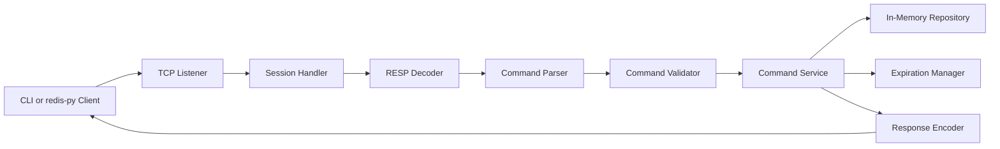
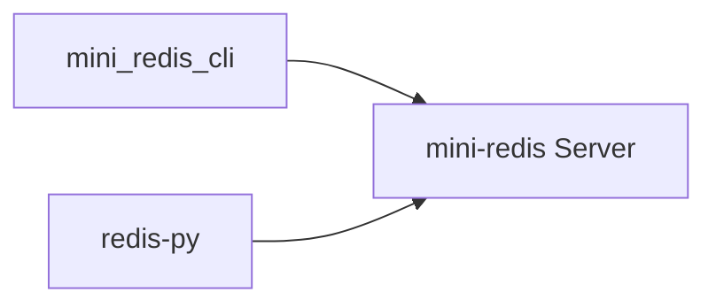
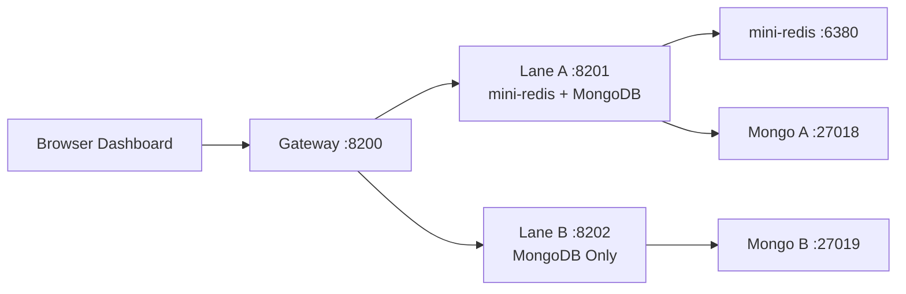
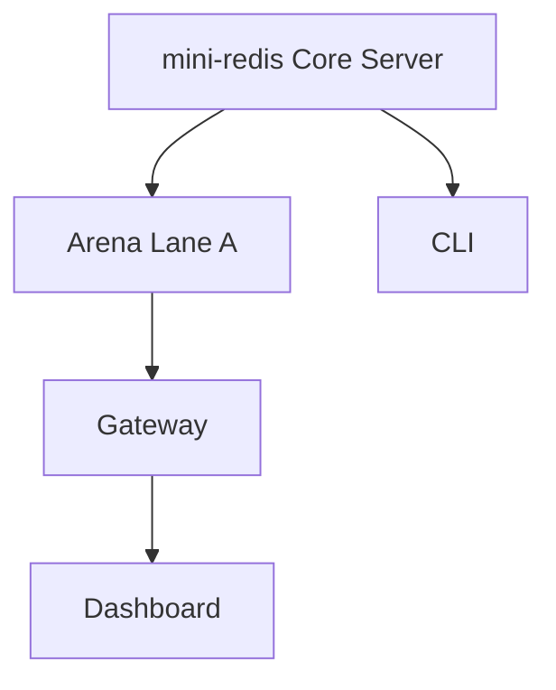

# mini-redis

`mini-redis`는 Redis의 핵심 개념을 직접 구현해보는 서버 프로젝트이고, 같은 저장/조회 요청을 `mini-redis + MongoDB`와 `MongoDB Only`로 비교하는 Arena를 함께 담고 있다. 저장소의 중심은 어디까지나 `mini-redis` 서버다. Arena는 이 서버를 실제 캐시 엔진처럼 바깥 프로세스로 띄운 뒤, `redis-py` 경계로 붙어서 활용한다.

## 한눈에 보기

| 구성 | 역할 |
| --- | --- |
| `mini-redis` | RESP 기반 in-memory key-value server, CLI, TTL, eviction, 자료구조 확장 |
| `arena` | `mini-redis + MongoDB`와 `MongoDB Only`를 같은 입력으로 비교하는 test-app |

---

## 1. mini-redis

### 핵심 요약

`mini-redis`는 단순한 딕셔너리 실습이 아니라, Redis가 왜 Redis처럼 동작하는지를 보여주기 위해 TCP, RESP, 명령 파이프라인, 자료형, TTL, eviction, CLI까지 하나의 흐름으로 연결한 프로젝트다.

### 세부 사항

이 프로젝트의 출발점은 “값을 저장하는 메모리 서버”가 아니라 “Redis의 핵심 설계 포인트를 직접 구현해보는 서버”였다. 그래서 구현 범위를 처음부터 다음처럼 잡았다.

- TCP 소켓 기반 서버
- RESP 요청/응답 처리
- 명령 파싱과 검증
- 타입이 있는 in-memory 저장소
- TTL과 background sweep
- CLI와 `redis-py` 호환 경계
- `String`, `Hash`, `List`, `Set`, `Sorted Set`

즉 `mini-redis`는 단순히 `SET/GET`만 되는 toy server가 아니라, Redis를 읽을 때 보게 되는 여러 개념을 하나씩 프로젝트 안에서 실제 코드로 밟아볼 수 있도록 구성돼 있다.

### 핵심 요약

서버의 핵심은 “네트워크 처리”, “명령 해석”, “비즈니스 실행”, “저장소 접근”을 분리한 파이프라인 구조다.

### 세부 사항

요청은 아래 경로를 따라 흐른다.



이 구조가 중요한 이유는 각 단계의 책임이 명확하기 때문이다.

- `internal/protocol/resp`
  - 바이트 스트림을 RESP 프레임으로 읽고 RESP 응답으로 다시 만든다.
- `internal/command`
  - 명령 이름과 인자를 파싱하고 검증한다.
- `internal/service`
  - 명령의 실제 동작을 수행한다.
- `internal/repository`
  - 메모리 저장소와 TTL 메타데이터를 다룬다.
- `internal/expiration`
  - 지연 삭제와 주기적 정리를 담당한다.
- `internal/server`
  - 연결, 세션, shutdown을 담당한다.

이 분리는 학습 측면에서도 중요하다. RESP가 잘못됐을 때 어디를 봐야 하는지, 타입 오류가 났을 때 어디를 봐야 하는지, TTL이 안 지워질 때 어디를 봐야 하는지가 코드 구조만으로 드러난다.

### 핵심 요약

자료구조 확장은 “키마다 정확히 하나의 타입을 가진다”는 Redis의 기본 규칙 위에서 구현했다.

### 세부 사항

현재 지원하는 자료형과 명령군은 다음과 같다.

- `String`
  - `SET`, `GET`, `DEL`, `EXPIRE`, `TTL`
- `Hash`
  - `HSET`, `HGET`, `HDEL`, `HGETALL`
- `List`
  - `LPUSH`, `RPUSH`, `LPOP`, `RPOP`, `LRANGE`
- `Set`
  - `SADD`, `SREM`, `SMEMBERS`, `SISMEMBER`
- `Sorted Set`
  - `ZADD`, `ZREM`, `ZRANGE`, `ZSCORE`

핵심은 “키 하나 = 타입 하나”다. 같은 키에 대해 `String`으로 저장한 뒤 `HGET`을 날리면 `WRONGTYPE` 계열 오류가 나와야 하고, TTL은 모든 자료형에 공통으로 적용되어야 한다. 이 규칙을 서비스 계층에서 일관되게 유지했다.

이 선택 덕분에 `mini-redis`는 단순 문자열 저장소가 아니라 “자료구조를 가진 command server”에 가까워졌다.

### 핵심 요약

TTL과 eviction은 이 프로젝트가 단순 저장소에서 한 단계 더 넘어가게 만드는 기능이다.

### 세부 사항

TTL은 두 방식으로 처리한다.

1. 지연 삭제
   - `GET`, `DEL`, `TTL`, `EXPIRE` 같은 접근 시점에 만료 여부를 검사한다.
2. background sweep
   - 접근이 없더라도 주기적으로 만료 키를 정리한다.

또한 Arena 실험을 위해 `maxmemory`와 eviction도 넣었다.

- `CONFIG SET maxmemory`
- `INFO MEMORY`
- `DBSIZE`
- `FLUSHDB`

이 기능 덕분에 `mini-redis`는 “무한정 다 담기는 캐시”가 아니라, 실제 캐시처럼 메모리 상한을 가지고 오래된 값을 밀어낼 수 있는 실험 대상이 됐다. Arena에서 `256B / 512B / 1024B / 2048B` 프로필을 바꾸며 miss, fill, eviction을 비교할 수 있는 이유도 여기에 있다.

### 핵심 요약

CLI와 `redis-py`를 모두 고려한 경계가 있기 때문에, 이 서버는 학습용이면서도 실제 Redis 사용 방식과 가까운 경험을 제공한다.

### 세부 사항

프로젝트는 두 가지 클라이언트 경로를 가진다.



- CLI
  - 단일 명령 실행
  - 대화형 REPL
  - `HELLO 3` 협상
- `redis-py`
  - Arena에서 실제 client로 사용
  - 기본 RESP2 연결을 수용하고 필요 시 RESP3로 전환

즉 이 프로젝트는 “우리가 만든 CLI로만 붙을 수 있는 서버”가 아니라, 외부 Python client도 붙일 수 있는 서버를 목표로 진화했다.

### 핵심 요약

테스트는 구현 보조물이 아니라, 명세를 코드로 고정하는 역할을 한다.

### 세부 사항

테스트는 크게 세 층으로 나뉜다.

- core unit test
  - parser, validator, service, expiration, repository
- compatibility test
  - `redis-py` 기본 연결, RESP3, memory control
- arena test
  - gateway, lane, scenario, manual command, dashboard contract

이 덕분에 프로젝트는 “작동하는 것처럼 보이는 상태”가 아니라, 최소한 다음 질문들에 답할 수 있게 됐다.

- RESP 요청이 맞게 해석되는가
- 타입 오류가 일관적으로 나는가
- TTL이 실제로 정리되는가
- memory cap이 strict 하게 적용되는가
- `mini-redis`를 Arena가 실제 캐시처럼 쓸 수 있는가

---

## 2. Arena

### 핵심 요약

Arena는 `mini-redis`를 외부 캐시 서버처럼 띄운 뒤, 같은 요청을 `mini-redis + MongoDB`와 `MongoDB Only`에 동시에 보내 비교하는 test-app이다.

### 세부 사항

Arena의 목적은 단순 데모가 아니다. “캐시가 붙은 경로”와 “DB만 쓰는 경로”를 같은 조건에서 비교해, Redis가 유리한 상황과 그렇지 않은 상황을 한 화면에서 보게 만드는 것이다.

현재 구조는 다음과 같다.



이 구조의 중요한 점은 `mini-redis`가 Arena 내부 객체가 아니라 **별도 서버 프로세스**라는 점이다. 즉 Arena는 Redis를 흉내내는 것이 아니라, 우리가 만든 `mini-redis`를 실제 캐시 엔진처럼 사용한다.

### 핵심 요약

비교 기준은 gateway 시간이 아니라 각 lane 내부의 `service_time_ms`다.

### 세부 사항

같은 요청이 들어오면 gateway는 두 lane에 fan-out 한다.

- lane A
  - Redis hit/miss 확인
  - 필요하면 Mongo fallback
  - cache fill
- lane B
  - Mongo direct read/write

그리고 각 lane은 자기 프로세스 안에서 시간을 측정한다.

- `service_time_ms`
- `db_time_ms`
- `redis_time_ms`
- `gateway_round_trip_ms`

이 기준 덕분에 “브라우저에서 본 체감 시간”이 아니라 “각 아키텍처가 실제로 처리에 쓴 시간”을 비교할 수 있다.

### 핵심 요약

대시보드는 설명용 UI가 아니라, 실시간으로 비교 가능한 모니터링 화면으로 설계했다.

### 세부 사항

상단은 좌우 대칭이다.

- 왼쪽: `mini-redis + MongoDB`
- 오른쪽: `MongoDB Only`

각 영역에서 다음을 동시에 본다.

- `Latency`
- `Storage Activity`
- `Storage Usage`
- `Answer`

하단 패널은 제어 영역이다.

- `Status`
- `Manual Command`
- `Input Scenarios`

여기서 중요한 점은 Arena가 단순 chart 모음이 아니라는 것이다. 사용자는 직접 `SET / GET / DEL / HSET / HGET / HGETALL`을 날릴 수 있고, memory profile과 TTL profile을 바꾸고, `Read / Write / Mixed` 시나리오를 실행하면서 그래프가 어떻게 달라지는지 바로 확인할 수 있다.

### 핵심 요약

시나리오는 “Redis가 무조건 빠르다”를 보여주기 위한 것이 아니라, 어떤 workload에서 어떤 trade-off가 생기는지를 드러내기 위해 설계했다.

### 세부 사항

현재 시나리오는 세 가지다.

- `Read`
  - `0 / 20 / 40 / 60 / 80 / 100` 단계의 hot-cold 분포
- `Write`
  - 쓰기 중심 workload
- `Mixed`
  - 읽기/쓰기/삭제 혼합 workload

글로벌 제어값도 같이 적용된다.

- `Memory`
  - `256B / 512B / 1024B / 2048B`
- `TTL`
  - `OFF / 0.5s / 1s / 2s / 3s / 5s / 10s`

이 조합으로 다음을 관찰할 수 있다.

- warm read에서 Redis hit가 얼마나 유리한가
- 작은 memory에서 eviction이 얼마나 자주 나는가
- TTL이 짧을수록 miss와 refill이 어떻게 늘어나는가
- write-heavy 상황에서 `Redis + DB`가 왜 더 비쌀 수 있는가

### 핵심 요약

Arena는 `mini-redis`를 검증하는 도구이면서, 동시에 `mini-redis`를 활용하는 하나의 응용 프로젝트다.

### 세부 사항

이 저장소의 중심은 `mini-redis` 서버다. Arena는 그 위에 쌓인 두 번째 층이다.



즉 이 저장소는 두 개의 독립 프로젝트를 억지로 붙여둔 것이 아니라,

1. Redis 개념을 구현한 서버를 만들고
2. 그 서버를 실제 캐시처럼 활용하는 앱을 만든

형태로 읽는 것이 가장 정확하다.

---

## 3. 실행 요약

### 핵심 요약

core server는 단독으로 실행할 수 있고, Arena는 별도 로컬 스택으로 한 번에 올릴 수 있다.

### 세부 사항

### mini-redis 서버만 실행

```bash
PYTHONPATH=. python cmd/mini_redis_server/main.py
```

### CLI 사용

```bash
PYTHONPATH=. python cmd/mini_redis_cli/main.py SET mykey hello
PYTHONPATH=. python cmd/mini_redis_cli/main.py HSET user name mini
PYTHONPATH=. python cmd/mini_redis_cli/main.py HGET user name
```

### Arena 전체 실행

```bash
./scripts/arena-local-up.sh
./scripts/arena-local-status.sh
./scripts/arena-local-down.sh
```

기본 접속 주소:

- Dashboard: `http://127.0.0.1:8200`
- Lane A: `http://127.0.0.1:8201`
- Lane B: `http://127.0.0.1:8202`

---

## 4. 저장소 지도

### 핵심 요약

이 저장소는 “서버 코어”, “Arena 앱”, “실행 진입점”, “문서”, “테스트”의 다섯 덩어리로 읽으면 가장 빠르다.

### 세부 사항

```text
cmd/
  mini_redis_server/   # mini-redis 서버 실행
  mini_redis_cli/      # CLI 실행
  arena_gateway/       # Arena gateway 실행
  arena_lane_a/        # Redis + Mongo lane 실행
  arena_lane_b/        # Mongo only lane 실행

internal/
  protocol/resp/       # RESP decoding / encoding
  command/             # parser / validator / errors
  service/             # command execution
  repository/          # in-memory value / ttl store
  expiration/          # ttl manager / sweeper
  server/              # socket accept / session / shutdown
  arena/               # gateway / lane / scenario / mongo / event

web/arena_dashboard/   # Arena dashboard
scripts/               # local arena orchestration
tests/                 # core + arena tests
docs/                  # architecture and implementation docs
Lesson/                # study materials
```

---

## 5. 읽는 순서

### 핵심 요약

이 저장소를 처음 읽는 사람이라면, 서버를 먼저 보고 그 다음 Arena를 보는 순서가 가장 좋다.

### 세부 사항

추천 순서는 다음과 같다.

1. `internal/server`
2. `internal/protocol/resp`
3. `internal/command`
4. `internal/service`
5. `internal/repository`, `internal/expiration`
6. `cmd/mini_redis_cli`
7. `internal/arena`
8. `web/arena_dashboard`

좀 더 학습 친화적인 순서가 필요하면 [Lesson/README.md](Lesson/README.md)를 기준으로 보면 된다.
